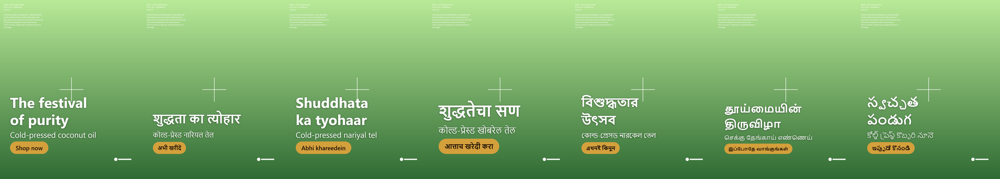

# Marketing Campaign Generator

Instagram campaign creatives from a brief or a reference image, in Indian
languages, built on Microsoft AI Foundry with **MAI-Image-2.6**.

📖 **[Full documentation](docs/)** — architecture, constraints, API, typography,
compliance, decisions, roadmap.

---

## The one idea

Generate **one text-free image**. Composite the logo and every language's text
deterministically on top.

Three verified facts force this:

1. **MAI-Image-2.6 declares `Languages: en`.** Asking it to draw Devanagari or
   Tamil is outside its supported envelope, and Indic scripts need complex
   shaping the model garbles in a uniquely dangerous way — the output looks
   plausible to an English-speaking operator and illiterate to the audience.
2. **The model allows 2–12 requests per minute.** Six languages across four
   formats as separate calls is not physically possible.
3. **Azure OCR cannot extract 8 of the Indic scripts.** For most of our
   languages we could not verify model-drawn text even if we wanted it. We do
   not ship what we cannot check.

So the seventh language costs **zero** model calls, the logo is byte-exact
rather than hallucinated, and QA for the text path is arithmetic instead of
inference.

**Measured: 2 image calls → 14 deliverables.**



*All seven v1 locales from one image generation. Each auto-fitted to its own
script's metrics, all inside the Instagram safe zone. The background is mock
mode; the typography and compositing are the real pipeline.*

---

## Quick start

No Azure subscription needed — `MAI_MOCK` defaults to on.

```bash
python -m venv .venv
.venv/Scripts/python -m pip install -r backend/requirements.txt
.venv/Scripts/python -m playwright install chromium
```

Run the tests (121, ~15s):

```bash
cd backend && ../.venv/Scripts/python -m pytest -q
```

Render one campaign in all seven locales and build a contact sheet — the visual
gate for the riskiest part of the product:

```bash
cd backend && ../.venv/Scripts/python scripts/language_proof.py
```

Run the API:

```bash
cd backend && ../.venv/Scripts/python -m uvicorn app.main:app --reload
```

```bash
curl -X POST localhost:8000/api/campaigns -H "content-type: application/json" -d "{\"brief\":\"a glass bottle of coconut oil on dark walnut, warm festive bokeh\",\"formats\":[\"portrait\",\"story\"],\"occasion\":\"Diwali\",\"occasion_by_locale\":{\"bn\":\"Durga Puja\"}}"
```

Then poll `/api/jobs/{id}` and download `/api/jobs/{id}/bundle`. Full reference
in [docs/api.md](docs/api.md).

---

## Connecting real Foundry

Three commands. The Azure CLI is **not** installed by default.

```bash
winget install --id Microsoft.AzureCLI -e
```

Open a **new** terminal so `PATH` refreshes, then sign in and provision. The
resource name must be globally unique — it becomes your endpoint hostname.

```bash
az login
```

```powershell
./scripts/setup_foundry.ps1 -ResourceName <your-unique-name> -WriteEnv
```

The script checks prerequisites, creates the resource and project, confirms
MAI-Image-2.6 is actually offered to your subscription *before* deploying,
deploys both 2.6 and 2.6-Flash, and writes your `.env`. Add `-WhatIf` to see
what it would do without creating anything.

It deploys to **`southindia`** by default — one of only two regions carrying
MAI-Image-2.6, and a good fit for an India-focused product.

Then verify, and answer the questions the documentation cannot:

```bash
cd backend && ../.venv/Scripts/python scripts/probe_foundry.py
```

This measures real generation latency, checks whether output carries C2PA
credentials, confirms the edits endpoint's output geometry, and writes a report
you can paste into
[#29](https://github.com/rudrakshxgupta/marketing-campaign-generator/issues/29).
It costs **3 image calls** by default and tells you exactly how many it used.

Auth uses Entra ID via `DefaultAzureCredential` — your `az login`. No API key
is needed, and none should be used in production.

> **File the quota-increase request the same day**:
> [aka.ms/oai/stuquotarequest](https://aka.ms/oai/stuquotarequest). Priority
> goes to accounts already using their allocation, so the clock starts when you
> begin generating, not when you ask.

> ⚠️ **MAI image models are public preview**: no SLA, and Microsoft's own docs
> say not recommended for production workloads. That is a business risk to
> accept deliberately. Every call is isolated in
> `backend/app/foundry/image_client.py` so the blast radius of an API change
> stays small.

---

## Layout

```
backend/app/
  config.py                 settings; MAI_MOCK defaults on
  main.py                   FastAPI; generation is always a job
  pipeline.py               one generation -> N language variants
  foundry/                  the only place that calls MAI, + mock + rate limiting
  imaging/                  dimensions, safe zones, compositing, Chromium overlay
  copy/                     languages, prompt construction, transcreation
docs/                       full documentation
.github/backlog.json        29 issues as data, with an idempotent seeder
```

See [docs/code-map.md](docs/code-map.md) for the module-by-module reference.

---

## Things that are easy to get wrong

Each of these is covered properly in [docs/constraints.md](docs/constraints.md).

**Dimensions.** `width ≥ 768`, `height ≥ 768`, `width × height ≤ 1,048,576`.
Exact 9:16 computes to a 767px side and is **rejected**; 1.91:1 landscape needs
a 740px side and is **unreachable**. Both are generated at the nearest legal
aspect and cropped. `width`/`height` are parameters of the **generations**
endpoint only — the edits endpoint takes no dimensions.

**Text rendering.** `PIL.features.check("raqm")` is `False` here, so Pillow
cannot shape Indic scripts — `ImageDraw.text` would silently emit unreordered,
disconnected glyphs. Text goes through Chromium.

**Safe zones.** Meta unified the 9:16 safe zone in March 2026: top 14%, bottom
35% for Reels, left/right 6% — a usable box of **950×979**. These raise, they
do not warn.

**The logo is never described to the model.** A diffusion model produces a
plausible logo, which is a wrong logo — and describing a mark in a prompt asks
the model to reproduce a trademark. Same for the product, maps of India, and
the flag.

**Copy is transcreated, not translated.** Each language is authored from a
shared strategy, so the cultural referent can change and not just the words — a
Diwali line becomes a *Pujo* line for Bengali.

---

## Spend controls

Image generation is the dominant cost and the quota is small, so this is
handled before anything touches Azure.

| | |
|---|---|
| **Hard ceiling** | 25/day, 200 total. Checked *before* the call, persisted to disk, survives restarts. A retry loop cannot drain anything. |
| **Failed calls are free** | A 429 or a network error is never charged to the ledger. |
| **Cache** | Byte-identical repeats come from disk. Re-clicking Generate costs nothing. |
| **Economy mode** | One tall master cropped down to every format. Measured: 4 formats went from 4 calls to 1. |

`GET /api/usage` reports spend, headroom and calls saved. A refused call gets
its own job state, `budget_exceeded` — nothing is broken, we deliberately
stopped short.

Raise the limits with `MAI_DAILY_LIMIT` and `MAI_TOTAL_LIMIT` once you are sure
the spend is intended.

## Status

**155 tests pass.** Phase 1 is complete and most of Phase 2 with it:
dimensions, safe zones, logo compositing, the Chromium text pipeline in seven
locales, the campaign pipeline, the job API, bundle export, the spend controls
above, and the reference-image path in both sub-modes.

**Not yet built**: the live Foundry text model (copy comes from a stub),
bundled fonts, Azure AI Content Safety, C2PA provenance, the OCR zero-text
gate, category compliance gates, and the React frontend.

`MaiImageClient` is written and unit-tested but has **never touched the real
endpoint** — mock mode is on by default and a test asserts it stays on.

36 issues track everything: **18 built, 18 pending**. See
[docs/roadmap.md](docs/roadmap.md).
